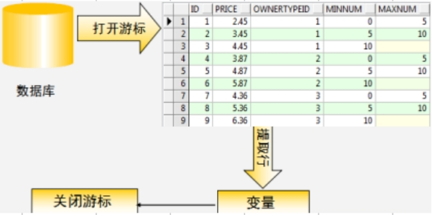

# GaussDB


## 1. 游标

### 1.1 什么是游标

游标是数据库为用户开设的一个数据缓冲区,存放SQL语句的执行结果。我们可以把游标理解为PL/SQL中的结果集。



游标本质上是内存中的一块区域，用来临时存储SQL的结果集。它提供了一个指针，该指针初始化时指向结果集的第一行，然后可以根据需要通过FETCH语句移动，以访问结果集中的每一行数据。

游标是一个指向结果集的指针，通过游标可以实现：

1. 定位到结果集中的特定行
2. 逐行遍历结果集
3. 对每一行数据执行特定操作
4. 可以修改或删除当前指向的行（取决于游标类型）


### 1.2 游标的分类

GaussDB 中的游标主要分为两类：

1. 隐式游标
2. 显式游标

**隐式游标：** 隐藏的游标，不会主动显示

- 游标由系统自动创建，当执行增删改查语句时系统会自动创建一个隐式游标来处理这些操作的结果；游标的打开和关闭由系统自动控制，当需要使用游标中数据时，游标自动打开，当代码执行完成后游标自动关闭。

**显式游标**： 

- 当查询的结果是多行数据时，需要使用显示游标来保存其查询结果
- 游标的声明打开和关闭需要手动控制(书写程序控制)
- 使用 **fetch into** 逐行获取游标中每一行的数据，第一次使用fetch into获取完第一行数据时，再次使用fetch into 可以获取游标下一行的数据，配合循环使用可以一直获取完游标中的所有数据

**游标的属性**（无论是隐式游标还是显示游标都有以下四个属性）

| 游标的属性 | 返回值类型 | 说明                                        |
| ---------- | ---------- | ------------------------------------------- |
| %ROWCOUNT  | 整型       | 获得游标中数据的行数                        |
| %FOUND     | 布尔型     | 最近的FETCH语句返回一行数据则为真，否则为假 |
| %NOTFOUND  | 布尔型     | 与%FOUND属性返回值相反，代表游标结束        |
| %ISOPEN    | 布尔型     | 游标已经打开时值为真，否则为假              |

> 游标在访问属性的时候，需要使用游标名来访问。例如：游标名称%ROWCOUNT。
>
> 使用隐式游标时不需要指定游标名称，所以在使用隐式游标的时候采取统一的一个名称 `SQL` ，例如：SQL%ROWCOUNT。

示例：隐式游标使用属性

- sql%ROWCOUNT 通常用于获取前一个 DML 操作（如 UPDATE、DELETE、INSERT）影响的行数

对于 SELECT 查询，需要使用其他方式获取行数

~~~plsql
begin
	update emp set sal = sal + 100 where deptno = 10;
	raise info '一共更新了 % 条数据',sql%ROWCOUNT; 
end;
~~~


### 1.3 游标的语法格式

在 GaussDB 中，使用游标主要分为四个步骤，所以语法上也拆分为4部分。

~~~plsql
DECLARE
    -- 1. 声明游标
    cursor 游标名字 [return return_type] is  select查询语句;
BEGIN
    -- 2. 打开游标
    open 游标名称
    loop
       -- 3. 通过游标获取数据
       fetch 游标名称  into  行记录变量
       /* 代码 */
    end loop;
    -- 4. 关闭游标
    close 游标名称
END;
~~~

游标语法示例：

~~~plsql
declare
    -- 1. 声明游标
	cursor cur_customer is select * from customer; 
	v_customer  customer%rowtype;  -- 行记录变量
begin
    -- 2.打开游标
	open cur_customer; 
	-- 3. 取出游标
	fetch cur_customer into v_customer;  -- 每fetch一下，就取出一条数据
	raise info '%',v_customer.customer_name; 
	
	fetch cur_customer into v_customer;  -- 每fetch一下，就取出一条数据
	raise info '%',v_customer.customer_name;
	
	-- 4. 关闭游标
	close cur_customer; 
end;
~~~


### 1.4 游标的使用

#### 1.4.1 隐式游标的使用

| 隐式游标的属性   | 返回值类型 | 说明                                                         |
| :--------------- | :--------: | ------------------------------------------------------------ |
| **SQL%ROWCOUNT** |   整数型   | 用来判断游标中有几条数据                                     |
| **SQL%FOUND**    |   布尔型   | 表示游标当前行是否有数据<br />值为true表示游标当前行有数据<br />值为false表示游标中当前行没有数据 |
| **SQL%NOTFOUND** |   布尔型   | 与SQL%FOUND相反                                              |
| **SQL%ISOPEN**   |   布尔型   | 值为true表示游标处于打开状态；值为false表示游标处于关闭状态； |

~~~plsql
DECLARE
    v_ename varchar(30);
BEGIN
    -- SQL%ROWCOUNT
    RAISE NOTICE '执行前 ROWCOUNT 的值: %',SQL%ROWCOUNT;  -- null 
     -- SQL%FOUND
    RAISE NOTICE '执行前 FOUND 的值: %',SQL%FOUND;   -- null
    
    SELECT ename
    INTO v_ename
    FROM emp e 
    WHERE empno = 7788;

    -- 再使用修改语句进行验证
--    UPDATE emp 
--    SET comm = comm+1
--    WHERE deptno = 30;

    RAISE NOTICE '执行后 ROWCOUNT 的值: %',SQL%ROWCOUNT;   -- 1
    RAISE NOTICE '执行后 FOUND 的值: %',SQL%FOUND;         -- t
END;
~~~


#### 1.4.2 显式游标的使用

| 属性名          | 返回值类型 | 含义                                                         |
| --------------- | ---------- | ------------------------------------------------------------ |
| 游标名%ROWCOUNT | 数值类型   | 表示游标中有多少行数据                                       |
| 游标名%FOUND    | 布尔类型   | 值为true,表示当前游标中有数据<br/>值为false,表示当前游标中没有数据 |
| 游标名%NOTFOUND | 布尔类型   | 和 游标名%FOUND 相反                                         |
| 游标名%ISOPEN   | 布尔类型   | 值为true,表示游标处于打开状态<br/>值为false,表示游标处于关闭状态 |

示例：利用游标获取客户信息并打印输出

~~~plsql
DECLARE 
    -- 1.声明显示游标
    CURSOR cur_customer_info IS 
           SELECT * FROM customer; 
    -- 行记录变量
    v_customer  customer%rowtype;
BEGIN
    -- 2.打开游标
    OPEN cur_customer_info;

    LOOP
        -- 3.利用游标提取数据
        FETCH cur_customer_info INTO v_customer;
        
        -- 什么时候结束循环?  --> 游标当前行没有数据时结束循环
        -- 结束循环,要求条件的值为 true
        EXIT WHEN cur_customer_info%NOTFOUND;  
        
        RAISE NOTICE '%,%',v_customer.customer_name,v_customer.address; 
    END LOOP;
    
    -- 4.关闭游标
    CLOSE cur_customer_info;
END;
~~~

#### 1.4.3 游标结合WHILE循环

~~~plsql
DECLARE 
    -- 1.声明显示游标
    CURSOR cur_customer_info IS SELECT * FROM customer; 
    -- 行记录变量
    v_customer  customer%rowtype;
BEGIN
    -- 2.打开游标
    OPEN cur_customer_info;

    -- 3.利用游标提取数据
    FETCH cur_customer_info INTO v_customer;
    -- 在fetch前 FOUND 属性的值为null,不会进入循环
    -- 所以需要在循环前手动fetch一次游标的数据
    
    WHILE cur_customer_info%FOUND LOOP
        --输出
        RAISE NOTICE '%,%',v_customer.customer_name,v_customer.address; 
        
        -- 再次通过游标提取数据
        FETCH cur_customer_info INTO v_customer;
    END LOOP;
    -- 4.关闭游标
    CLOSE cur_customer_info;
END;
~~~


#### 1.4.4 使用FOR循环简化游标

~~~plsql
DECLARE 
    -- 1.声明显示游标
    CURSOR cur_customer_info IS 
           SELECT * FROM customer; 
    -- 行记录变量
    v_customer  customer%rowtype;
BEGIN
    -- 使用FOR循环,不需要手动的打开和关闭游标,
    -- 进入FOR循环时,会自动打开游标,FOR循环结束之后会自动关闭游标
    FOR v_customer IN cur_customer_info LOOP
        RAISE NOTICE '%,%',v_customer.customer_name,v_customer.address; 
    END LOOP;
END;
~~~

再次精减：

~~~plsql
DECLARE 
    -- 行记录变量
    v_customer  customer%rowtype;
BEGIN
    -- 使用FOR循环,不需要手动的打开和关闭游标,
    -- 进入FOR循环时,会自动打开游标,FOR循环结束之后会自动关闭游标
    FOR v_customer IN (SELECT * FROM customer) LOOP
        RAISE NOTICE '%,%',v_customer.customer_name,v_customer.address; 
    END LOOP;
END;
~~~


## 2. 动态SQL

### 2.1 什么是动态SQL

GaussDB 数据库中的动态SQL是一种在程序运行时根据不同条件或参数动态生成SQL语句的技术。它打破了静态SQL 语句固定不变的限制，允许开发者灵活调整查询逻辑，适应多样化的业务需求。例如，当需要根据用户输入的表名或查询条件来执行不同的操作时，动态SQL 就能派上用场。

> 动态SQL：在程序运行时动态构建和执行的SQL语句。
>
> 静态SQL：在程序编译时就固定好的SQL语句。

动态SQL的优势：

1. **灵活性高**：可以在运行时构建不同的SQL语句，适应不同的需求。
2. **处理复杂的查询**：可以根据不同的输入参数或条件，生成复杂的查询语句。
3. **动态执行 DDL 操作**：对于创建表、修改表结构等 DDL 语句，动态 SQL 可以根据运行时的参数动态生成。例如，根据业务需求动态创建分区表或索引。


### 2.2 动态SQL的使用

GaussDB 支持使用`EXECUTE IMMEDIATE`语句执行动态生成的 SQL。该语句可以处理 SELECT、INSERT、UPDATE、DELETE 等 DML 操作，以及部分 DDL 操作。

#### 2.2.1 EXECUTE IMMEDIATE

示例1：使用动态SQL创建表

~~~plsql
DECLARE
  -- 声明变量
  v_create_table VARCHAR2(200);
BEGIN
  -- SQL语句字符串
  v_create_table := 'create table test1(id number, name varchar2(30))';
 
  -- 动态SQL执行
  EXECUTE IMMEDIATE v_create_table;

END;
~~~

示例2：使用动态SQL插入固定数据

~~~plsql
DECLARE 
    -- 声明变量
	v_sql varchar(300);
BEGIN
	-- 将插入语句写成字符串的形式, 在字符串中需要将完成的插入语句写好
	-- 需要对单引号进行转义, 单引号之间使用一个单引号进行转义 
	-- ''  前一个单引号表示的是转义字符, 后一个单引号表示一个单引号字符串
	v_sql := 'insert into test1 values(1,''zhangsan'')';
	
	RAISE NOTICE '%',v_sql;
	-- 使用动态SQL向数据表中插入数据
	EXECUTE IMMEDIATE v_sql;
END;
~~~

示例3：使用动态SQL插入可变数据

~~~plsql
DECLARE 
    -- 声明变量
	v_sql varchar(300);
	v_id int;
	v_name varchar(30);
BEGIN
	v_id := 3;
	v_name := 'wangwu';
	v_sql := 'insert into test1 values(:1 , :2)'; -- :1 表示占位符，:A 也可以
	
	RAISE NOTICE '%',v_sql;
	-- 执行动态SQL，并给要执行的SQL语句中的占位符，赋于具体的值
	EXECUTE IMMEDIATE v_sql USING v_id,v_name; -- USING 实现赋值
END;
~~~

- 参数类型匹配：`USING`参数的类型必须与 SQL 中占位符的期望类型一致，否则会报错。

示例4：使用动态SQL查询数据

~~~plsql
declare
	var test1%rowtype;
	v_sql varchar2(200) := 'select * from test1 where id=:1';
begin
    execute immediate v_sql into var using 1;
    -- :1 表示占位符，:A 也可以
    raise info '%',var.name;	
end;
~~~

EXECUTE IMMEDIATE：
	1.该语句可以处理多数动态SQL操作，包括DDL语句，比如CREATE、ALTER、DROP等；
	2.DCL语句，比如GRANT、REVOKE等；
	3.DML语句，比如INSERT、UPDATE、DELETE等，以及单行的SELECT语句。
	4.不能使用EXECUTE IMMEDIATE来处理多行的查询语句，多行查询需要用动态游标。
	5.可以使用 into 接收查询结果的数据，使用 using 向SQL语句中传入值，如果同时要写into和using，要求 into 必须写在 using前


#### 2.2.2 动态游标

动态游标：游标中存储的数据可以动态改变，相比于显式游标，显式游标中的数据在声明时就已经确定不能再改变。

语法：

~~~plsql
declare
       -- 1.声明游标类型
       type 游标类型名 is ref cursor;
       -- 2.使用游标类型
       游标名  游标类型名;
begin
     -- 3.打开游标，绑定查询语句;
     open 游标名 for select 查询语句;
     
     -- 4.使用循环获取游标中的数据，和显式游标的方式一致
     
     -- 5.关闭游标
     close 游标名;
end;
~~~

示例：

~~~plsql
-- 声明一个游标类型，要求使用该类型游标先查询dept表中的所有数据，然后再查询emp表中30号部门的数据
DECLARE
  -- 1.声明游标类型
  TYPE ref_cursor_type IS REF CURSOR;

  -- 2.声明变量，使用游标类型
  emp_dept_cur ref_cursor_type;

  v_dept dept%ROWTYPE;
  v_emp  emp%ROWTYPE;
BEGIN
  -- 查询dept表中的所有数据
  -- 3.打开游标绑定查询语句
  OPEN emp_dept_cur FOR
    SELECT * FROM  dept;

  -- 4.使用loop循环获取数据
  LOOP
    FETCH emp_dept_cur INTO v_dept;
      EXIT WHEN emp_dept_cur%NOTFOUND;
    RAISE NOTICE '%',v_dept;
  END LOOP;
  -- 关闭游标
  CLOSE emp_dept_cur;

  -- 查询emp表中30号部门的数据
  OPEN emp_dept_cur FOR
    SELECT * FROM  emp WHERE  deptno = 30;

  FETCH emp_dept_cur INTO v_emp;
  WHILE emp_dept_cur%FOUND LOOP
    RAISE NOTICE '%',v_emp;
    FETCH emp_dept_cur INTO v_emp;
  END LOOP;
  -- 关闭游标
  CLOSE emp_dept_cur;
END;
~~~


## 3. 异常处理

### 3.1 什么是异常

异常（Exception）是程序中发生的意外情况或错误。这些异常可以在程序执行期间捕获和处理，以防止程序崩溃。

当代码出现异常后，会使得代码在异常出现的位置终止运行，所以需要对异常进行处理，用自己的代码逻辑去替换异常的错误信息

> 程序执行时发生异常后，语句将停止执行，控制权转移到 PL/SQL 块的异常处理部分。


### 3.2 异常类型

异常有两种类型：

1. 预定义异常
   - 特点：当PL/SQL程序违反数据库规则或超过系统限制时自动触发
2. 自定义异常
   - 特点：在PL/SQL块的声明部分定义异常，自定义异常通过 RAISE 语句显式引发


### 3.3 系统预定义异常

系统预定义异常一共21 种，最常用：**NO_DATA_FOUND**，**TOO_MANY_ROWS**

|     预定义异常      |                 说明                 |
| :-----------------: | :----------------------------------: |
|  **NO_DATA_FOUND**  |      select into语句无返回数据       |
|  **TOO_MANY_ROWS**  | 在执行select into 语句时结果集有多行 |
|    LOGIN_DENIED     |   使用无效的用户名和口令登录Oracle   |
|   INVALID_NUMBER    |  试图将一个非有效的字符串转换成数字  |
|  DUP_VAL_ON_INDEX   |   重复的值存储在使用唯一索引的列中   |
|  ACCESS_INTO_NULL   |    试图给一个没有初始化的对象赋值    |
|     ZERO_DIVIDE     |                除以0                 |
|     VALUE_ERROR     |            算术或转换错误            |
| TIMEOUT_ON_RESOURCE |         在等待资源时发生超时         |

示例：

```plsql
declare 
  v_name emp.ename%type;
begin
  select ename 
  into v_name 
  from emp 
  where DEPTNO=20;
  
 RAISE NOTICE '%',v_name;

exception  --异常的处理
   when NO_DATA_FOUND then 
     RAISE NOTICE '未找到数据';
     RAISE NOTICE '%',SQLCODE;
     RAISE NOTICE '%',SQLERRM;
   when TOO_MANY_ROWS then 
     RAISE NOTICE '查询结果太多数据';
     RAISE NOTICE '%',SQLCODE;
     RAISE NOTICE '%',SQLERRM;
   when OTHERS then 
     RAISE NOTICE '其它异常';
end;
```

异常有关的函数：

- **SQLCODE**：异常代码，当需要查找可能导致此类问题的通用信息时，此代码非常有用。
- **SQLERRM**：异常信息，该文本通常包含特定于应用程序的数据，例如约束的名称或与问题关联的列。


### 3.4 自定义异常

在PL/SQL块的声明部分定义异常，自定义异常通过 RAISE 语句显式引发。

语法：

~~~plsql
declare   
  -- 1.自定义异常名
  异常名  exception;
begin
  -- plsql代码;
  
  -- 2.在合适的时机手动抛出异常
  raise 异常名;

-- 异常处理代码
exception  
  -- 根据异常名捕获异常
  when 异常名 then
    -- 异常处理方式         
end; 
~~~

示例：

~~~plsql
-- 自定义异常，在业务中要comm字段的值不能为空值，最低为0
-- 如果出现空值，则抛出异常
DECLARE
  -- 1.自定义异常名
  v_comm_is_null EXCEPTION;
  v_comm emp.comm%TYPE;
BEGIN
  SELECT comm 
  INTO v_comm
  FROM emp
  WHERE empno = 7788;
  
  -- 如果出现空值，则抛出异常
  IF v_comm IS NULL THEN
    RAISE v_comm_is_null;
  END IF;

EXCEPTION
  WHEN v_comm_is_null THEN
     RAISE NOTICE 'COMM 字段值为空';
     RAISE NOTICE '%',SQLCODE;
     RAISE NOTICE '%',SQLERRM;        
END;
~~~


## 4. 日志表

在数据库开发里，日志表是一种特别的表，它的主要功能是记录和数据库操作相关的各类信息，像用户行为、系统事件、错误详情等都能记录下来。日志表在数据库的日常运维、故障排查以及审计工作中都起着至关重要的作用。

### 4.1 什么是日志

日志是记录程序运行状态事件的信息,当PLSQL代码进行运行时,需要将代码的运行状态收集起来存放到**日志表**中。

> 在生产环境中，通常会将异常信息收集到日志表中，后续只需追踪日志表中的信息。


### 4.2 日志表的作用

在PLSQL中日志表的作用：

1. 可以帮助用户快速定位代码中异常出现的位置

   在存储过程中，会将存储过程中每一个步骤的执行信息记录到日志表中，当步骤出现异常时，可以通过查询日志表快速定位异常出现的位置

2. 可以帮助用户去优化存储过程

   日志表中记录了存储过程每一个步骤的执行时长，可以根据执行时长降序排序，找出耗时较长的步骤，针对耗时较长的步骤进行专门的优化

   先对其进行执行计划分析,首先查看其是否使用索引进行查询,

   - 如果没有使用索引进行查询, 先判断是否对字段创建了索引,如果没有,创建对应索引;
   - 如果有,说明索引失效,分析索引失效的原因: 一共9点
   - 如果使用了索引查询,可以对表建立合适的分区, 从分区中查询数据,减少数据查询量
   - 此外还可以对sql语句进行优化(SQL优化方案)


### 4.3 日志表的使用

日志表，属于一种特殊的表。用于记录PLSQL程序在运行过程中一些核心的操作信息。

创建日志表：

~~~plsql
create table error_log(
	error_id	int, 			-- 日志ID，无任何业务功能
	pro_name	varchar2(30),	-- 程序名称
	start_dt	timestamp,	 	-- 程序开始时间
	end_dt		timestamp,		-- 程序结束时间
	pro_status	varchar2(30),	-- 程序执行状态
	error_code	varchar2(50),	-- 异常代码
	error_errm	varchar2(200)	-- 异常信息
);

-- 创建序列
create sequence seq_test2;
~~~

收集信息到日志表：

~~~plsql
declare
	v_sql 		varchar2(200);
	pro_name 	varchar2(20) := '测试';
	start_dt	timestamp;
	end_dt		timestamp;
	pro_status	varchar2(20);
	error_code	varchar2(50);
	error_errm	varchar2(200);
begin
	start_dt := sysdate;
	v_sql := 'create table test2(id int)';
	execute immediate v_sql; 
	end_dt  := sysdate;
	pro_status := '成功';
	-- 插入日志
	insert into error_log values
	(1,pro_name,start_dt,end_dt,pro_status,error_code,error_errm);
exception 
	when others then
		end_dt  := sysdate;
		pro_status := '失败';
		error_code := sqlcode;
		error_errm := sqlerrm;
		insert into error_log values
		(1,pro_name,start_dt,end_dt,pro_status,error_code,error_errm);
end;
~~~


## 5. 练习任务

1. 为贷款ID为1的贷款生成12期等额本息还款计划，使用FOR循环插入数据到`repayment_schedule`表。每期金额固定（假设月供为8774.32），状态为“未到期”。

2. 使用游标遍历所有产品，统计每个产品的不良贷款率（逾期贷款数/总贷款数），输出结果。

3. PL/SQL程序：还款计划分类（利用动态SQL+异常处理+日志表 ）

   - 根据`repayment_schedule`表中`status`字段下的不同状态值，利用动态SQL创建不同的数据表

     `table1` -> 已结清、`table2` ->未到期、`table3`逾期

   - 根据条件`status`的不同状态值，分别查询`repayment_schedule`表中相关数据，插入到对应的数据表中。例：`status='已结清'的数据插入到table1表中` （提示：可以考虑使用动态SQL）

   - PLSQL程序中需要有异常处理的代码，当程序在执行过程中在发生异常，则通过异常处理记录到`error_log`日志表中

   - PLSQL程序中需要使用`option_log`日志表，跟踪记录程序执行过程信息

     - 记录1—表创建成功时，在`option_log`日志表中记录：id、操作事件[CREATE TABLE | INSERT]、SQL语句、SQL语句参数、开始时间、结束时间、状态[成功 | 失败]
     - 记录2—表中插入数据时， 在`option_log`日志表中记录信息

   


